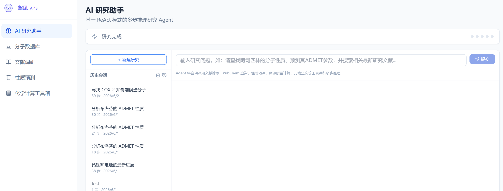
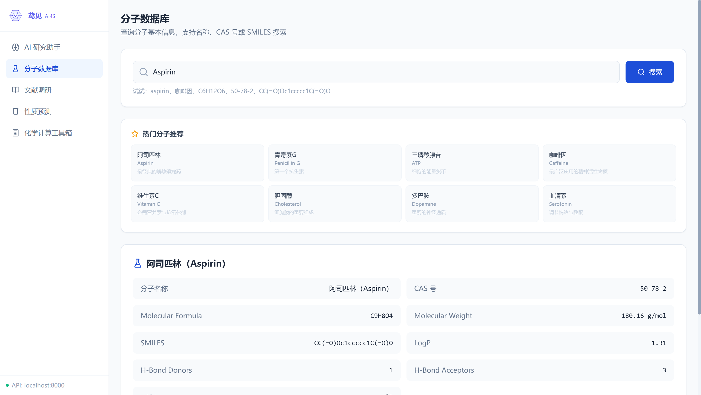
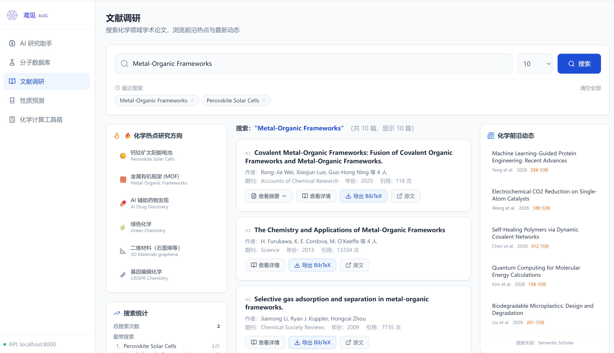
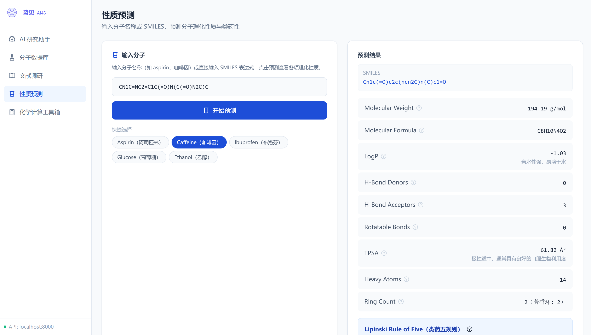
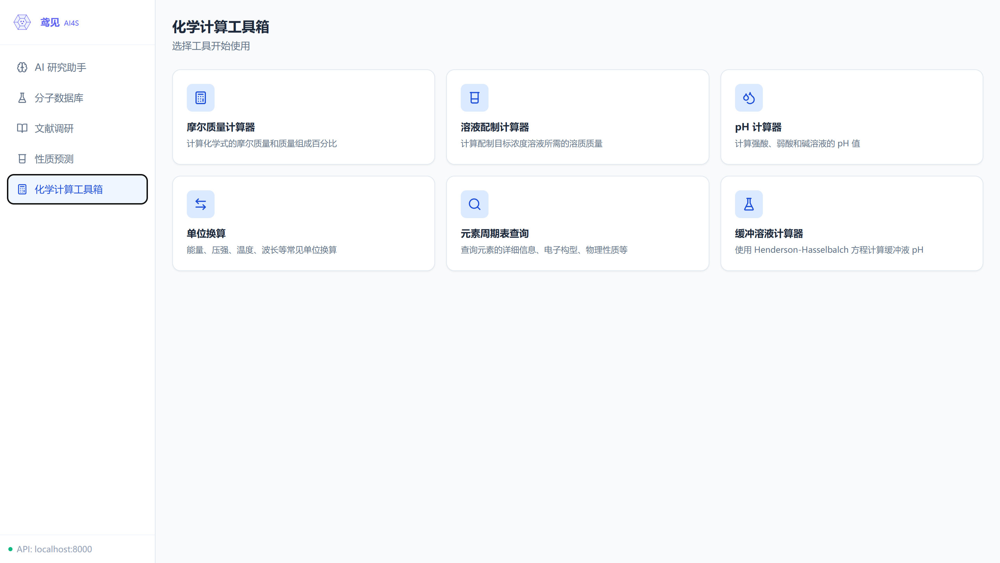

# 鸢见 · YuanJian — AI 化学科研平台

<p align="center">
  <em>基于 ReAct 推理的化学与材料科学 AI 科研助手</em>
</p>

<p align="center">
  <a href="https://www.python.org/downloads/"></a>
  <a href="https://fastapi.tiangolo.com/"></a>
  <a href="https://react.dev/"></a>
  <a href="https://vitejs.dev/"></a>
  <a href="https://www.typescriptlang.org/"></a>
  <a href="https://tailwindcss.com/"></a>
  <a href="https://www.rdkit.org/"></a>
  <a href="https://www.deepseek.com/"></a>
  <a href="https://semanticscholar.org/"></a>
  <a href="https://pubchem.ncbi.nlm.nih.gov/"></a>
  <a href="https://www.docker.com/"></a>
  <a href="https://github.com/Echos-boop/ai4s-infra/blob/master/LICENSE"></a>
</p>

---

## 项目简介

**鸢见 (YuanJian)** 是一个面向化学与材料科学研究的 AI 平台，将大语言模型 (DeepSeek) 的推理能力与化学信息学工具 (RDKit、PubChem、Semantic Scholar) 深度集成。

核心是一个基于 **ReAct (Reasoning + Acting)** 模式的科研 Agent，能够自主规划研究步骤、调用工具获取数据、综合分析并生成结构化研究报告。

> 参考：深势科技 [BohrClaw](https://github.com/deepmodel/BohrClaw)，arxiv:2512.20469

---

## 截图







---

## 核心功能

### 🤖 AI 科研 Agent（ReAct 多步推理）
- 基于 DeepSeek Function Calling 的 Thought → Action → Observation 循环
- SSE 流式推送推理过程，实时可见
- 自动调用 5 个科研工具：文献搜索、PubChem 查询、性质预测、摩尔质量计算、元素查询
- 生成 Markdown 格式研究报告，支持导出 Word (.docx)
- 会话历史管理，支持追问模式（携带前文结论）

### 🔬 分子数据库（PubChem）
- 支持化合物名称、CAS 号、SMILES 多模式检索
- 展示分子式、分子量、LogP、TPSA、氢键供体/受体数等
- SMILES 结构式 2D 渲染（RDKit SVG）

### 📚 文献调研（Semantic Scholar / CrossRef）
- 学术论文搜索，支持中英文关键词
- 论文摘要、作者、期刊、引用数、DOI 链接
- BibTeX 引用导出
- 热点研究方向推荐与化学前沿动态

### ⚗️ 性质预测（RDKit ADMET）
- 分子量、LogP、氢键供体/受体、TPSA、可旋转键、环数
- Lipinski 类药五规则自动评估
- ADMET 性质雷达图（吸收/分布/代谢/排泄/毒性/类药性）

### 🧮 化学计算工具箱
- **摩尔质量计算器**：支持括号嵌套和水合物
- **溶液配制计算器**：已知浓度配制 + 稀释计算
- **pH 计算器**：强/弱酸、强/弱碱，pH 色卡可视化
- **化学单位换算**：能量/压强/温度/波长 4 大类
- **交互式元素周期表**：86 元素完整数据，族对比雷达图

### 📊 基础平台能力
- 数据接入管道（Connector → Ingestion → Validation → Catalog）
- 数据版本管理（Snapshot / Lineage）
- HPC 调度与监控（Slurm / Kubernetes 连接器）
- RLHF 反馈收集与策略优化（PPO / DPO）

---

## 技术栈

| 类别 | 技术 |
|------|------|
| **后端框架** | Python 3.10+, FastAPI, Uvicorn |
| **前端框架** | React 18, TypeScript, Vite 5 |
| **CSS** | Tailwind CSS 3 |
| **LLM** | DeepSeek API (Function Calling) |
| **化学信息学** | RDKit, PubChem REST API |
| **文献检索** | Semantic Scholar API, CrossRef API |
| **数据库** | SQLite, PostgreSQL, Redis, Weaviate |
| **容器化** | Docker, Docker Compose |
| **监控** | Prometheus, Grafana |
| **HPC** | Slurm, Kubernetes |

---

## 本地运行

### 前置要求

- Python 3.10+
- Node.js 18+
- (可选) Docker & Docker Compose

### 1. 克隆项目

```bash
git clone https://github.com/Echos-boop/ai4s-infra.git
cd ai4s-infra
```

### 2. 安装后端依赖

```bash
pip install -e .
# 可选：安装 RDKit 和 PDF 支持
pip install -e ".[cheminformatics]"
# 或安装全部可选依赖
pip install -e ".[all]"
```

### 3. 安装前端依赖

```bash
cd frontend
npm install
cd ..
```

### 4. 配置环境变量

在项目根目录创建 `.env` 文件：

```bash
DEEPSEEK_API_KEY=your_api_key_here
DEEPSEEK_MODEL=deepseek-v4-flash
```

### 5. 启动服务

**方式一：Windows 一键启动**
```bash
start.bat
```

**方式二：分别启动**
```bash
# 终端 1 — 后端（端口 8000）
python main.py

# 终端 2 — 前端（端口 3000）
cd frontend && npm run dev
```

### 6. 访问

| 地址 | 说明 |
|------|------|
| http://localhost:3000 | 前端界面 |
| http://localhost:8000/docs | API 文档 (Swagger) |
| http://localhost:8000/health | 健康检查 |

---

## 环境变量说明

| 变量 | 必填 | 默认值 | 说明 |
|------|------|--------|------|
| `DEEPSEEK_API_KEY` | 是 | — | DeepSeek API 密钥，用于 Agent 推理 |
| `DEEPSEEK_MODEL` | 否 | `deepseek-v4-flash` | DeepSeek 模型名称 |
| `DEEPSEEK_BASE_URL` | 否 | `https://api.deepseek.com/v1` | API 基础地址 |

---

## 项目结构

```
ai4s-infra/
├── main.py                     # FastAPI 统一入口
├── pyproject.toml              # Python 依赖配置
├── docker-compose.yml          # 全部服务编排
├── start.bat                   # Windows 一键启动脚本
├── config/settings.yaml        # 全局配置
│
├── ai4s/                       # 后端 Python 包
│   ├── agent/                  # ReAct 科研 Agent
│   │   ├── orchestrator.py     # ReAct 循环 + 工具定义 + DeepSeek API
│   │   ├── router.py           # SSE 流式端点 + docx 导出
│   │   └── memory.py           # SQLite 会话记忆
│   ├── agent_runtime/          # Agent 运行时引擎
│   │   ├── tools/              # 工具注册中心、执行器、文献搜索、沙箱
│   │   ├── scheduler/          # 任务队列与调度
│   │   └── memory/             # 向量记忆
│   ├── data_infra/             # 数据基础架构
│   │   ├── ingestion/          # 数据接入 (PubChem/PDF)
│   │   ├── cleaning/           # 数据清洗与验证
│   │   └── versioning/         # 版本管理 (Catalog/Lineage/Snapshot)
│   ├── hpc_fusion/             # HPC 融合计算
│   ├── rlhf/                   # 人类反馈强化学习
│   └── common/                 # 共享组件 (配置/日志/指标)
│
├── frontend/                   # React 前端
│   ├── src/
│   │   ├── App.tsx             # 路由定义
│   │   ├── pages/              # 5 个功能页面
│   │   ├── api/client.ts       # API 客户端封装
│   │   ├── components/         # 通用组件
│   │   └── types/              # TypeScript 类型定义
│   └── vite.config.ts          # Vite 配置
│
├── docker/                     # Dockerfile + Prometheus/Grafana 配置
├── tests/                      # 各模块测试
└── docs/                       # 技术文档
```

---

## API 概览

| 端点 | 说明 |
|------|------|
| `POST /api/agent/run` | 运行科研 Agent (SSE 流式) |
| `POST /api/agent/export-docx` | 导出研究报告为 Word |
| `GET /api/agent/sessions` | 历史会话列表 |
| `POST /api/v1/data/predict` | SMILES 分子性质预测 |
| `GET /api/v1/data/pubchem/search` | PubChem 化合物搜索 |
| `GET /api/v1/data/molecules/render` | SMILES → 2D 结构 SVG |
| `POST /api/v1/agent/literature/search` | 文献搜索 |
| `GET /health` | 健康检查 |
| `GET /metrics` | Prometheus 指标 |

---

## 对标产品

本平台参考了以下工作：

- **深势科技 BohrClaw** — AI for Science 领域的 Agent 框架，通过 Large Language Model (LLM) 驱动的智能体自动化科学计算任务，支持多工具编排与复杂科研工作流。
- **arxiv:2512.20469** — "Scientific Agents: A Research Paradigm for AI-Driven Science"，系统性地提出了以 Agent 为核心的科学研究新范式。

---

## License

[MIT](LICENSE)

---

<p align="center">
  <sub>Built with AI4S · 让科学发现更快</sub>
</p>
